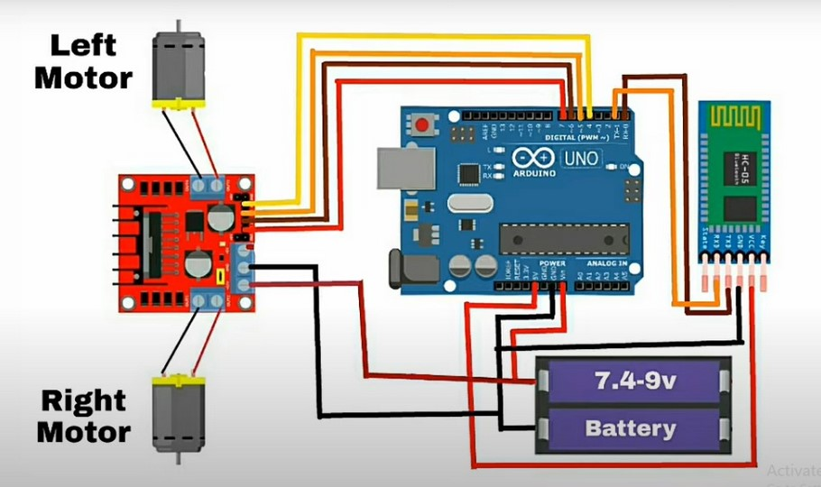
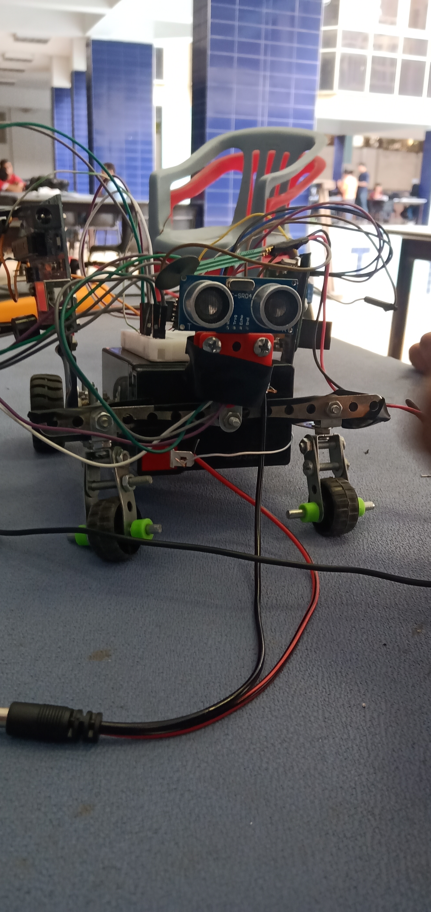
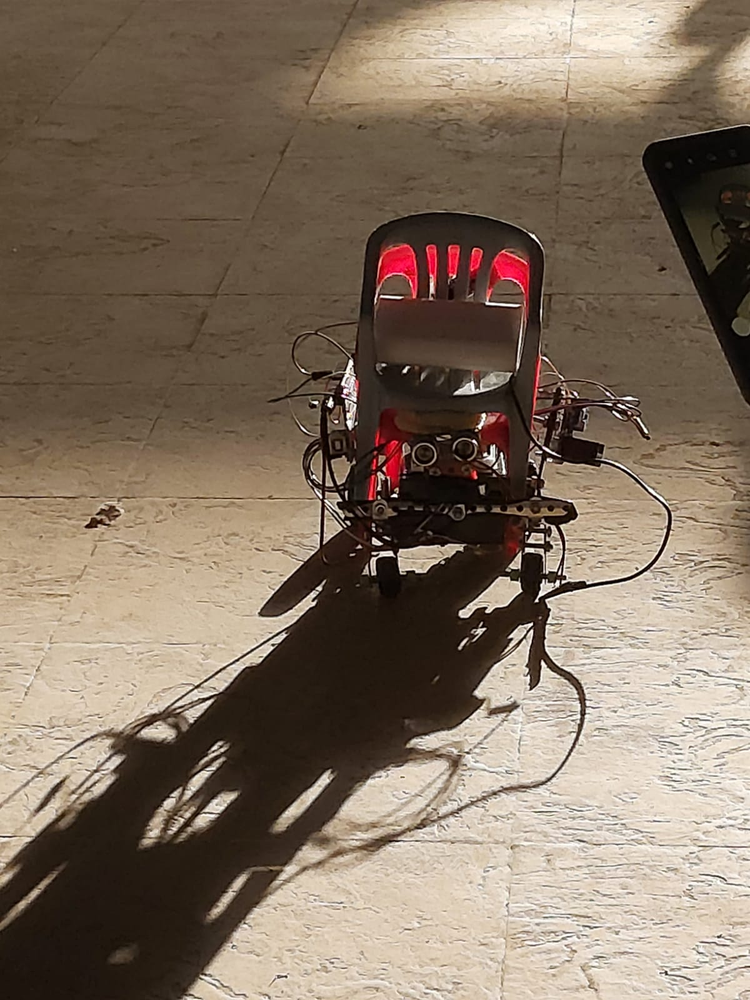
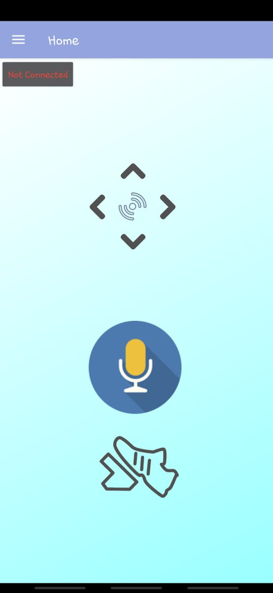

# Voice controlled wheelchair (with a companion app)

## What everything does.
code for arduino => "Auto_chair/Auto_chair.ino"
code for testing sensors => "Fall_detection/Fall_detection.ino"
companion app is in "companion app" folder.
for hardware installation keep reading.

## Summary
This is just a Prototype for a voice controlled wheelchair designed to help quadriplegics who can't use a brain-computer interface or don't have enough mobility to steer the chair.

In its current form, the chair responds to single word commands in arabic "forward / backward / left / right".
there's also buttons in the app in case the user had mobility (and also because it makes hardware testing easier, more on that later.)

There's also a few alarm systems installed in this Prototype
1. Fall detection:  A weight sensor installed to the seat to detect if the user becomes unstable and starts falling
2. Distance detection: A distance sensor to prevent the chair from colliding with walls, offices, etc.

## Hardware requirments:
1. Arduino uno
2. FSR
3. Ultrasonic sensor
4. Motor driver (H bridge)
5. Bluetooth module
5. 2 DC 12v motors (high torque)
6. 6V 4.5 Ah battery (High capcity)
7. Wires (A lot of them.)

## software requirments
1. upload the code to the arduino board
2. install the companion app (apk included in the repo inside the 'companion app' folder)
3. Connect to the Bluetooth module.
4. Turn your phone's language settings to arabic (if you want to use the voice controls)


## Circuit Diagram

the main thing here is to be careful with this battery, it's dangerous, you also gotta test the wires and other stuff before integrating things together, it'll save you a lot of troubleshooting time later.
also, cable management.

## Prototype photos

this is the bare electronics without the chair and load.

Full prototype basking in the warm april sun.


## Code parts
### What the code does (arduino):
let's look at the loop function

```
void loop {
checkFsr();//Check the force on the chair to make sure user didn't fall
checkDis(); // Check the distance in front of the chair
recvOneChar(); //check if there's a new order received from the app and store it
showNewData(); //display the order on the serial (for debug purposes)
steer(receivedChar); //use the order received from the app to move.
}
```
in the beginning we check the sensors to make sure it's safe to move, if not, we call the `stop()` method which turns both motors.
if it's save to move we receive the instructions sent from the application and use them to move either forward, left, etc.

### What the code does (application):

the arrows send one letter instructions to the board.
- forward => 'f'
- backward => 'b'
- left => 'l'
- right => 'r'

the brake pedal sends the letter 's' which immediately calls the `stop()` method

### Limitations
1. the voice recognition only works for a single word, so if you say "left left" it will not know what to do, you have to say "left" for it work properly (which is an easy fix, but yeah.)
2. the FSR is janky, it's really hard to get a consistent reading because the pressure has to be applied uniformly and the human body is not exactly that perfect, we're using a set of cushions to avoid this problem but they work only 75% of the time, which is actually still pretty good.

# conclusion
this is just a proof of concept, it's not meant to be actually used, However it still works surprisingly well, thanks for reading.
